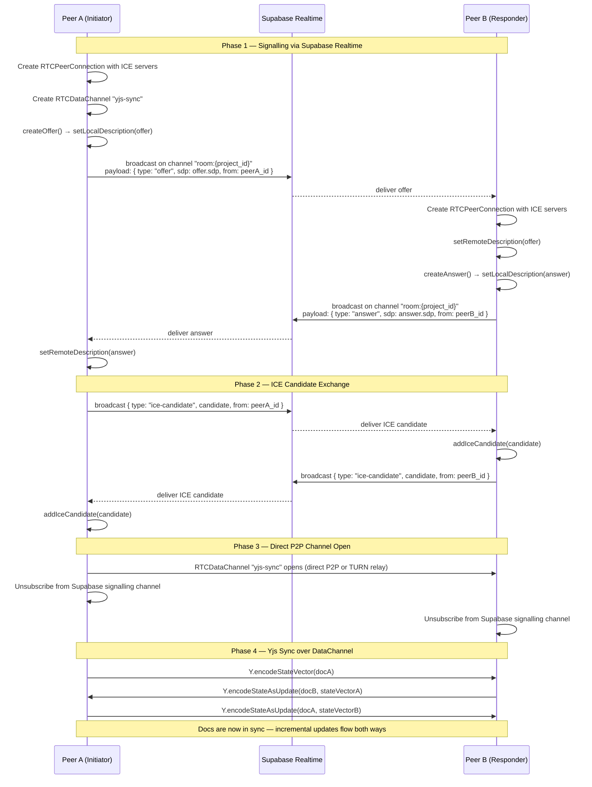
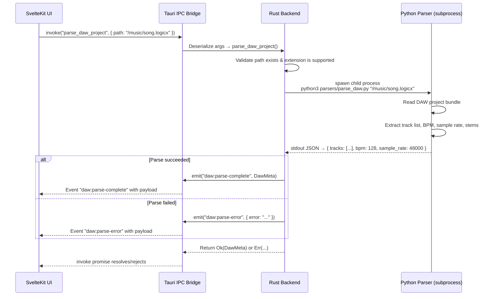
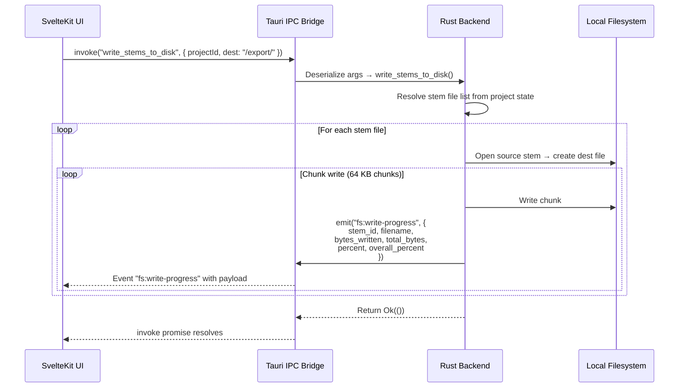

# Prod Box — Systems Architecture

> Zero-latency, peer-to-peer audio collaboration hub built on **Tauri v2**, **WebRTC**, and **Yjs**.

This document specifies the architecture for the three core runtime pillars that make
Prod Box work offline-first and peer-to-peer while staying in sync with the
Supabase-backed cloud layer.

---

## Table of Contents

1. [Pillar 1 — The Yjs State Machine](#pillar-1--the-yjs-state-machine)
2. [Pillar 2 — The WebRTC Transport Switchboard](#pillar-2--the-webrtc-transport-switchboard)
3. [Pillar 3 — The Tauri IPC Layer](#pillar-3--the-tauri-ipc-layer)
4. [Appendix A — Postgres Schema Reference](#appendix-a--postgres-schema-reference)

---

## Pillar 1 — The Yjs State Machine

### Goal

Map every mutable entity in the Supabase Postgres schema into a Yjs shared type
so that the Kanban board and the audio-stem versioning timeline operate
**offline-first** with automatic CRDT conflict resolution.

### Postgres → Yjs Type Mapping

The seven core Postgres tables and their Yjs counterparts:

| # | Postgres Table    | Yjs Type                        | Key / Index Strategy                          |
|---|-------------------|---------------------------------|-----------------------------------------------|
| 1 | `projects`        | `Y.Map<string, ProjectDoc>`     | Keyed by `project_id` (UUID)                  |
| 2 | `tracks`          | `Y.Array<TrackDoc>`             | Ordered array nested inside `ProjectDoc`      |
| 3 | `stems`           | `Y.Array<StemDoc>`              | Ordered array nested inside `TrackDoc`        |
| 4 | `stem_versions`   | `Y.Array<StemVersionDoc>`       | Append-only log nested inside `StemDoc`       |
| 5 | `kanban_boards`   | `Y.Map<string, KanbanBoardDoc>` | Keyed by `board_id` (UUID)                    |
| 6 | `kanban_columns`  | `Y.Array<KanbanColumnDoc>`      | Ordered array nested inside `KanbanBoardDoc`  |
| 7 | `kanban_cards`    | `Y.Array<KanbanCardDoc>`        | Ordered array nested inside `KanbanColumnDoc` |

### Yjs Document Tree

```
rootDoc (Y.Doc)
│
├── projects: Y.Map<project_id, ProjectDoc>
│   │
│   └── [project_id]: Y.Map
│       ├── name:        string
│       ├── bpm:         number
│       ├── sample_rate: number
│       ├── created_at:  string (ISO-8601)
│       ├── updated_at:  string (ISO-8601)
│       │
│       └── tracks: Y.Array<TrackDoc>
│           │
│           └── [index]: Y.Map
│               ├── track_id:   string (UUID)
│               ├── name:       string
│               ├── position:   number
│               ├── muted:      boolean
│               ├── solo:       boolean
│               │
│               └── stems: Y.Array<StemDoc>
│                   │
│                   └── [index]: Y.Map
│                       ├── stem_id:      string (UUID)
│                       ├── filename:     string
│                       ├── format:       string (wav | flac | mp3)
│                       ├── size_bytes:   number
│                       ├── uploaded_at:  string (ISO-8601)
│                       │
│                       └── versions: Y.Array<StemVersionDoc>
│                           │
│                           └── [index]: Y.Map
│                               ├── version_id:  string (UUID)
│                               ├── hash_sha256: string
│                               ├── created_at:  string (ISO-8601)
│                               └── comment:     string
│
└── kanban_boards: Y.Map<board_id, KanbanBoardDoc>
    │
    └── [board_id]: Y.Map
        ├── name:       string
        ├── project_id: string (UUID, foreign key)
        │
        └── columns: Y.Array<KanbanColumnDoc>
            │
            └── [index]: Y.Map
                ├── column_id: string (UUID)
                ├── title:     string
                ├── position:  number
                │
                └── cards: Y.Array<KanbanCardDoc>
                    │
                    └── [index]: Y.Map
                        ├── card_id:     string (UUID)
                        ├── title:       string
                        ├── body:        string
                        ├── assignee_id: string (UUID)
                        ├── position:    number
                        └── created_at:  string (ISO-8601)
```

### Sync Strategy

1. **Local-first writes** — All mutations go straight into the local Yjs doc.
   The SvelteKit store is derived from Yjs observeDeep events, so the UI
   updates instantly with zero network round-trips.

2. **Persistence** — The Yjs document state is persisted to IndexedDB using
   [y-indexeddb](https://github.com/yjs/y-indexeddb) so that state survives
   app restarts and full offline sessions.

3. **Cloud sync** — A lightweight provider bridges the Yjs update stream to
   Supabase Postgres via the following path:

   ```
   Yjs update → encode as base64 → INSERT into supabase `yjs_updates` table
   Supabase Realtime subscription → decode → Y.applyUpdate(localDoc, remoteUpdate)
   ```

   On reconnect, the provider fetches any missed updates ordered by
   `server_timestamp` and applies them in sequence. Yjs's CRDT merge
   guarantees convergence regardless of arrival order.

4. **Compaction** — Periodically (or on project close), the full Yjs state
   vector is snapshot via `Y.encodeStateAsUpdate(doc)` and stored as a single
   row, pruning older incremental updates.

### Why These Types?

| Decision                              | Rationale                                                                                            |
|---------------------------------------|------------------------------------------------------------------------------------------------------|
| `Y.Array` for tracks / stems / cards  | Preserves insertion order; supports drag-and-drop reordering via `Y.Array.insert` / `Y.Array.delete` |
| `Y.Map` for project / board metadata  | Keyed access; concurrent field edits merge cleanly                                                   |
| Append-only `Y.Array` for versions    | Stem versions are immutable once created; append-only avoids delete conflicts                        |
| Nested structure (not flat)           | Mirrors the Postgres foreign-key hierarchy; scopes Yjs observe listeners to subtrees                 |

---

## Pillar 2 — The WebRTC Transport Switchboard

### Goal

Establish a direct, low-latency **RTCDataChannel** between two Prod Box peers
for streaming Yjs document updates and audio chunk previews, using Supabase
Realtime as the signalling server and **Coturn** as the STUN/TURN relay for
NAT traversal.

> **Confidence Gatekeeper — Coturn**
> [Coturn](https://github.com/coturn/coturn) is the most widely deployed
> open-source STUN/TURN server. It is actively maintained, battle-tested at
> scale by Jitsi, Matrix/Element, and NextCloud Talk. Confidence: **99%**.
> Recommended.

> **Confidence Gatekeeper — simple-peer**
> [simple-peer](https://github.com/feross/simple-peer) is a thin, stable
> wrapper around the browser RTCPeerConnection API. It is mature, widely used,
> and handles offer/answer/ICE plumbing cleanly. Confidence: **97%**.
> Recommended for the initial signalling dance; the underlying
> RTCDataChannel is then used directly for Yjs transport.

### ICE Server Configuration

```jsonc
{
  "iceServers": [
    // Public STUN — used for reflexive candidate discovery
    { "urls": "stun:stun.l.google.com:19302" },
    // Self-hosted Coturn — STUN + TURN relay fallback
    {
      "urls": [
        "stun:turn.prodbox.app:3478",
        "turn:turn.prodbox.app:3478?transport=udp",
        "turn:turn.prodbox.app:3478?transport=tcp",
        "turns:turn.prodbox.app:5349?transport=tcp"
      ],
      "username": "<short-lived-credential>",
      "credential": "<short-lived-credential>"
    }
  ]
}
```

Short-lived TURN credentials are generated server-side via the Coturn
`use-auth-secret` mechanism (HMAC-SHA1 over a shared static secret and a
Unix-epoch expiry timestamp).

### Connection Flow



### Yjs ↔ WebRTC Provider Wiring

Once the RTCDataChannel `"yjs-sync"` is open, a custom Yjs provider bridges
local document updates to the channel:

```
┌──────────────┐          RTCDataChannel           ┌──────────────┐
│  Yjs Doc A   │  ──── binary Yjs updates ────▶    │  Yjs Doc B   │
│              │  ◀──── binary Yjs updates ────    │              │
│  y-indexeddb │          "yjs-sync"                │  y-indexeddb │
└──────────────┘                                    └──────────────┘
```

The provider:

1. Listens to `doc.on('update', (update) => channel.send(update))`.
2. Listens to `channel.onmessage = (msg) => Y.applyUpdate(doc, msg.data)`.
3. On channel open, performs the two-phase state-vector exchange shown in
   Phase 4 of the sequence diagram above.
4. On channel close (peer disconnect), re-subscribes to the Supabase Realtime
   signalling channel and waits for the peer to reconnect.

### Handling Multiple Peers

For rooms with more than two collaborators, each pair of peers establishes its
own RTCDataChannel (full mesh). The Yjs CRDT guarantees that updates arriving
from multiple peers converge to the same state regardless of order or
duplication.

Mesh topology is practical for the expected room size of **2–6 collaborators**.
If future requirements demand larger rooms, an SFU (Selective Forwarding Unit)
can replace the mesh, but that is out of scope for v1.

### Reconnection & Fallback

| Scenario                       | Behaviour                                                                                  |
|--------------------------------|--------------------------------------------------------------------------------------------|
| Temporary network drop (< 30s) | ICE restart via `pc.restartIce()`; DataChannel reconnects automatically                    |
| Prolonged disconnect           | Peer re-enters signalling channel; a fresh offer/answer cycle is initiated                 |
| Symmetric NAT (no P2P path)    | Coturn TURN relay is used; latency increases but connectivity is maintained                 |
| Supabase Realtime down         | Signalling is unavailable; peers that are already connected continue on the DataChannel     |

---

## Pillar 3 — The Tauri IPC Layer

### Goal

Provide a type-safe, async event bridge between the **SvelteKit** frontend
(WebView) and the **Rust** backend (Tauri core process) for two primary
workflows:

1. **DAW File Parsing** — Invoke local Python scripts that analyse `.logicx`,
   `.als`, and `.flp` project files and return structured metadata.
2. **Filesystem Write Progress** — Report real-time progress when writing large
   audio stems to disk (e.g., extracting stems from a DAW project).

> **Confidence Gatekeeper — dawtool**
> [dawtool](https://github.com/bdcht/dawtool) is a Python library for reading
> DAW project files. It supports Ableton Live (.als) and has partial Logic Pro
> support. Confidence: **70%** — insufficient for production use on Logic Pro
> `.logicx` bundles. We recommend using `dawtool` as a starting point for
> Ableton parsing, but **building a custom parser** for Logic Pro based on
> reverse-engineered `.logicx` bundle structure.

> **Confidence Gatekeeper — logicx-analyzer**
> I lack the confidence to recommend a pre-built solution for Logic Pro
> `.logicx` parsing; we must build a custom implementation. The `.logicx`
> format is a proprietary binary bundle and no actively maintained,
> battle-tested open-source parser exists at the required fidelity.

### Tauri Command Definitions (Rust)

All IPC is mediated through Tauri v2 **commands** (frontend → backend) and
**events** (backend → frontend).

```
┌───────────────────────────────────────────────────────────────────────┐
│                          SvelteKit (WebView)                         │
│                                                                      │
│   invoke("parse_daw_project", { path })  ──────────────────┐        │
│   invoke("write_stems_to_disk", { projectId, dest })  ─────┤        │
│                                                             │        │
│   listen("fs:write-progress")  ◀────────────────────────────┤        │
│   listen("daw:parse-complete") ◀────────────────────────────┤        │
│   listen("daw:parse-error")    ◀────────────────────────────┤        │
└─────────────────────────────────────────────────────────────┼────────┘
                                                              │
                            Tauri IPC bridge                  │
                                                              │
┌─────────────────────────────────────────────────────────────▼────────┐
│                         Rust Backend (Tauri Core)                    │
│                                                                      │
│   #[tauri::command]                                                  │
│   async fn parse_daw_project(path: String) -> Result<DawMeta, ...>  │
│       └── spawns: python3 parsers/parse_daw.py <path>               │
│       └── emits: "daw:parse-complete" or "daw:parse-error"          │
│                                                                      │
│   #[tauri::command]                                                  │
│   async fn write_stems_to_disk(                                      │
│       project_id: String, dest: String,                              │
│       app_handle: tauri::AppHandle                                   │
│   ) -> Result<(), ...>                                               │
│       └── streams file writes                                        │
│       └── emits: "fs:write-progress" { percent, bytes_written, ... }│
└──────────────────────────────────────────────────────────────────────┘
```

### Sequence Diagram — DAW Parse Flow



### Sequence Diagram — Filesystem Write Progress



### Python Parser Contract

The Rust backend spawns the Python parser as a child process and communicates
via **stdin/stdout JSON**. The parser must conform to this contract:

**Input** (command-line argument):

```
python3 parsers/parse_daw.py <absolute-path-to-daw-project>
```

**Output** (stdout, single JSON object):

```json
{
  "format": "logicx",
  "bpm": 128,
  "sample_rate": 48000,
  "time_signature": "4/4",
  "tracks": [
    {
      "name": "Vocals",
      "type": "audio",
      "stems": [
        {
          "filename": "Vocals_01.wav",
          "format": "wav",
          "size_bytes": 24000000,
          "duration_seconds": 245.5
        }
      ]
    }
  ]
}
```

**Error** (exit code ≠ 0, stderr):

```
ERROR: Unsupported DAW format: .rpp
```

The Rust side captures stdout, deserialises it into a `DawMeta` struct via
`serde_json`, and returns it to the frontend. If the process exits non-zero,
the stderr content is wrapped into a `daw:parse-error` event.

### IPC Payload Types (TypeScript)

```typescript
/** Returned by parse_daw_project */
interface DawMeta {
  format: "logicx" | "als" | "flp";
  bpm: number;
  sample_rate: number;
  time_signature: string;
  tracks: DawTrack[];
}

interface DawTrack {
  name: string;
  type: "audio" | "midi" | "aux";
  stems: DawStem[];
}

interface DawStem {
  filename: string;
  format: "wav" | "flac" | "mp3";
  size_bytes: number;
  duration_seconds: number;
}

/** Emitted during write_stems_to_disk */
interface WriteProgressEvent {
  stem_id: string;
  filename: string;
  bytes_written: number;
  total_bytes: number;
  percent: number;       // per-file 0–100
  overall_percent: number; // across all files 0–100
}
```

### Security Considerations

| Concern                        | Mitigation                                                                                           |
|--------------------------------|------------------------------------------------------------------------------------------------------|
| Arbitrary path access          | The Rust command validates that the path is within an allowed directory (project workspace)           |
| Python code injection          | The path argument is passed as a single CLI argument, never interpolated into a shell string          |
| Large file DoS                 | `write_stems_to_disk` enforces a configurable max total export size and aborts if exceeded            |
| TURN credential leakage        | Short-lived TURN credentials (TTL ≤ 1 hour) are generated server-side; never embedded in client code |

---

## Appendix A — Postgres Schema Reference

The seven core tables in Supabase Postgres that the Yjs State Machine mirrors:

```sql
-- 1. Projects
CREATE TABLE projects (
    project_id  UUID PRIMARY KEY DEFAULT gen_random_uuid(),
    name        TEXT NOT NULL,
    bpm         INTEGER NOT NULL DEFAULT 120,
    sample_rate INTEGER NOT NULL DEFAULT 48000,
    created_at  TIMESTAMPTZ NOT NULL DEFAULT now(),
    updated_at  TIMESTAMPTZ NOT NULL DEFAULT now()
);

-- 2. Tracks
CREATE TABLE tracks (
    track_id    UUID PRIMARY KEY DEFAULT gen_random_uuid(),
    project_id  UUID NOT NULL REFERENCES projects(project_id) ON DELETE CASCADE,
    name        TEXT NOT NULL,
    position    INTEGER NOT NULL DEFAULT 0,
    muted       BOOLEAN NOT NULL DEFAULT false,
    solo        BOOLEAN NOT NULL DEFAULT false
);

-- 3. Stems
CREATE TABLE stems (
    stem_id     UUID PRIMARY KEY DEFAULT gen_random_uuid(),
    track_id    UUID NOT NULL REFERENCES tracks(track_id) ON DELETE CASCADE,
    filename    TEXT NOT NULL,
    format      TEXT NOT NULL CHECK (format IN ('wav', 'flac', 'mp3')),
    size_bytes  BIGINT NOT NULL,
    uploaded_at TIMESTAMPTZ NOT NULL DEFAULT now()
);

-- 4. Stem Versions
CREATE TABLE stem_versions (
    version_id  UUID PRIMARY KEY DEFAULT gen_random_uuid(),
    stem_id     UUID NOT NULL REFERENCES stems(stem_id) ON DELETE CASCADE,
    hash_sha256 TEXT NOT NULL,
    created_at  TIMESTAMPTZ NOT NULL DEFAULT now(),
    comment     TEXT DEFAULT ''
);

-- 5. Kanban Boards
CREATE TABLE kanban_boards (
    board_id    UUID PRIMARY KEY DEFAULT gen_random_uuid(),
    project_id  UUID NOT NULL REFERENCES projects(project_id) ON DELETE CASCADE,
    name        TEXT NOT NULL
);

-- 6. Kanban Columns
CREATE TABLE kanban_columns (
    column_id   UUID PRIMARY KEY DEFAULT gen_random_uuid(),
    board_id    UUID NOT NULL REFERENCES kanban_boards(board_id) ON DELETE CASCADE,
    title       TEXT NOT NULL,
    position    INTEGER NOT NULL DEFAULT 0
);

-- 7. Kanban Cards
CREATE TABLE kanban_cards (
    card_id     UUID PRIMARY KEY DEFAULT gen_random_uuid(),
    column_id   UUID NOT NULL REFERENCES kanban_columns(column_id) ON DELETE CASCADE,
    title       TEXT NOT NULL,
    body        TEXT DEFAULT '',
    assignee_id UUID,
    position    INTEGER NOT NULL DEFAULT 0,
    created_at  TIMESTAMPTZ NOT NULL DEFAULT now()
);
```

Every column in these tables has a direct counterpart in the Yjs document tree
defined in [Pillar 1](#pillar-1--the-yjs-state-machine). The `REFERENCES`
foreign-key relationships map to the nesting hierarchy of the Yjs shared types.
